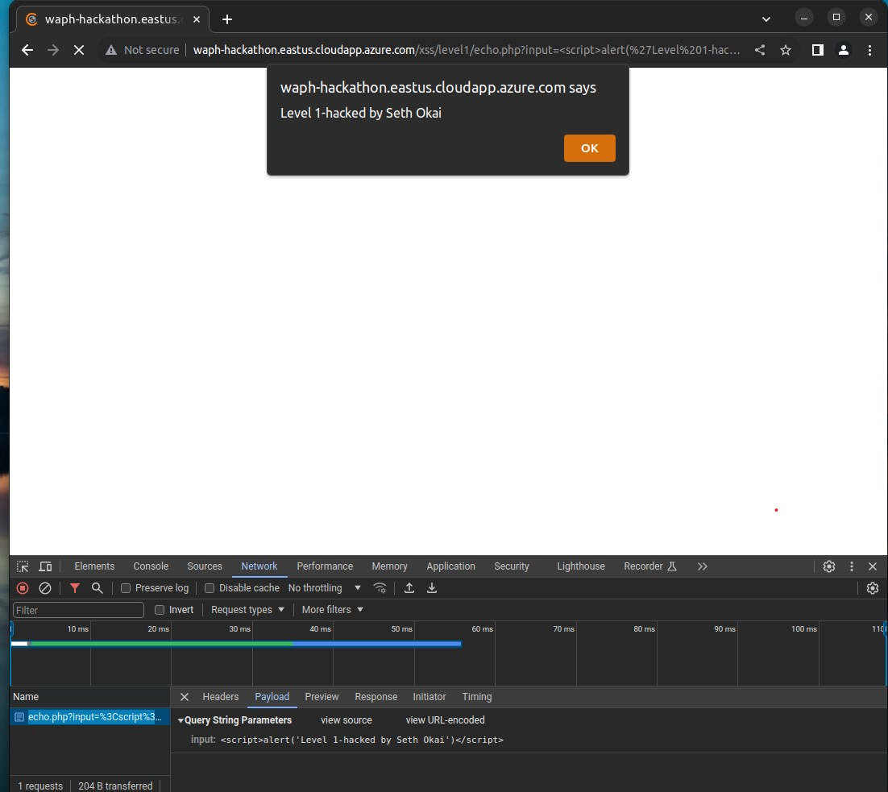
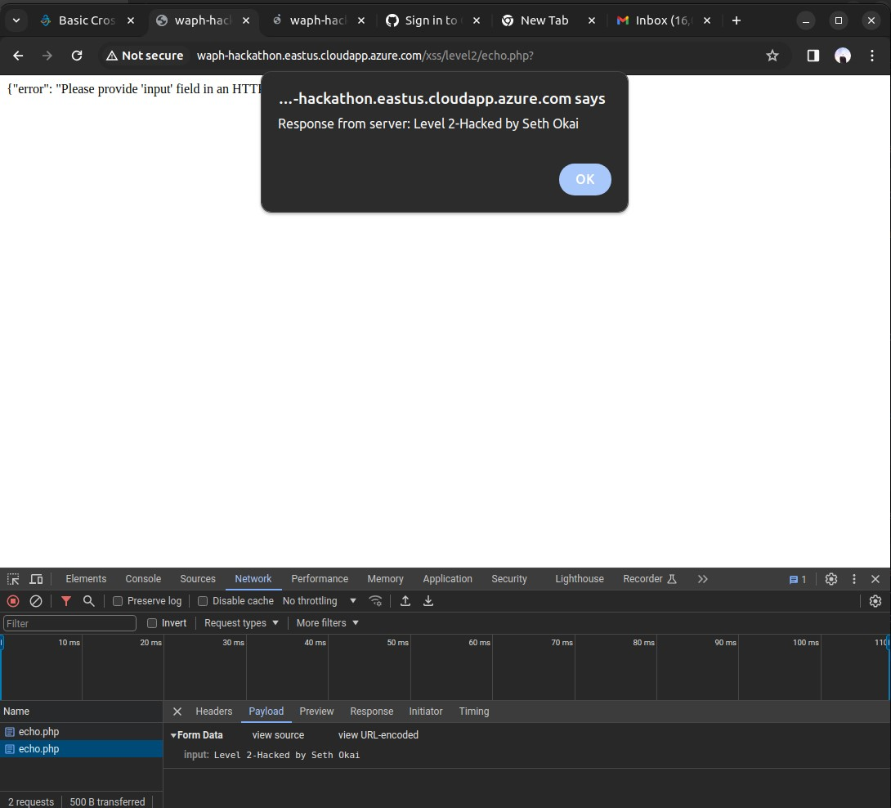
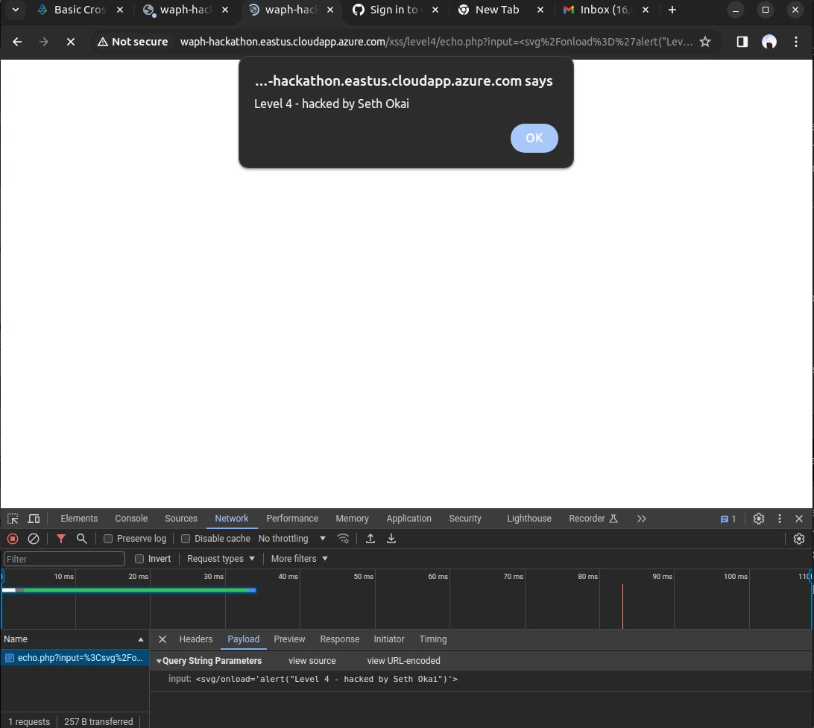
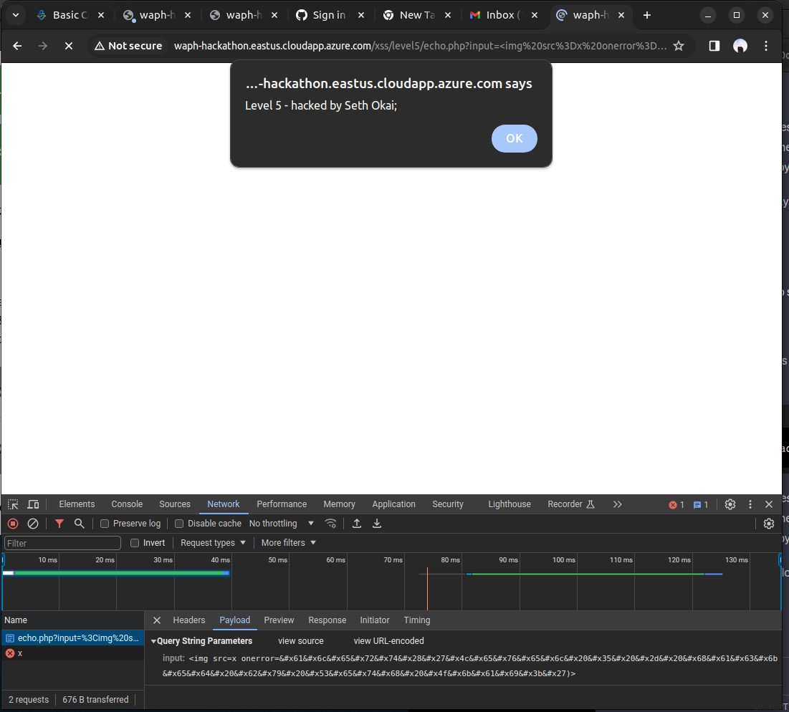
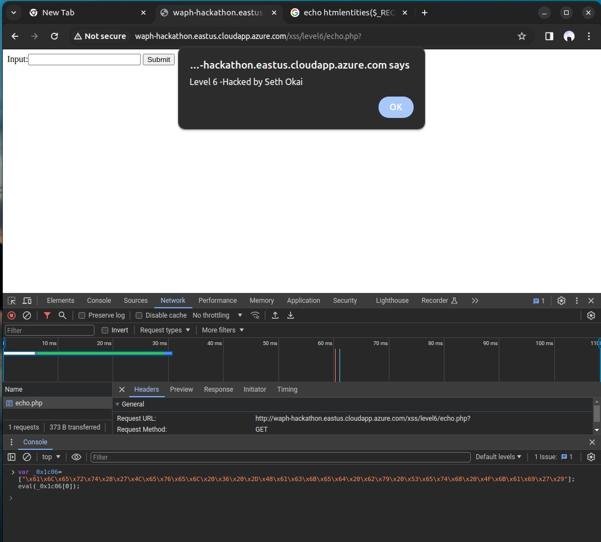

# WAPH-Web Application Programming and Hacking

## Instructor: Dr. Phu Phung

## Student: Seth Okai

# Hackathon 1 - Cross-site Scripting Attacks and Defenses

## The lab's overview
In my XSS exploitation endeavors, I successfully compromised Levels 2, 4, 5, and 6 of the target web application while encountering difficulties with Level 3. My methods involved crafting and executing JavaScript payloads through various injection points, showcasing vulnerabilities in the application's input handling mechanisms.

### Level 1

### Level 2
For Level 2, I utilized a POST request to inject an XSS payload into the application. By submitting a crafted payload through the console, I triggered an alert message, demonstrating the ability to execute arbitrary JavaScript code on the target page.

### Level 4
In Level 4, I employed an XSS payload embedded within an SVG tag. This payload was able to bypass the application's input filters and execute upon loading the SVG element, leading to the successful display of an alert message.

### Level 5
Level 5 posed a challenge due to script tag filtering. However, I overcame this obstacle by encoding my payload and injecting it as an image source attribute. By crafting the payload in this manner, I bypassed the script tag filter, allowing for the successful execution of JavaScript code upon image loading, resulting in the desired alert message being displayed.

### Level 6
In Level 6, I utilized an obfuscated JavaScript payload to bypass server-side defenses. Despite potential input validation and sanitization measures, the payload successfully executed, triggering the alert message as intended.

