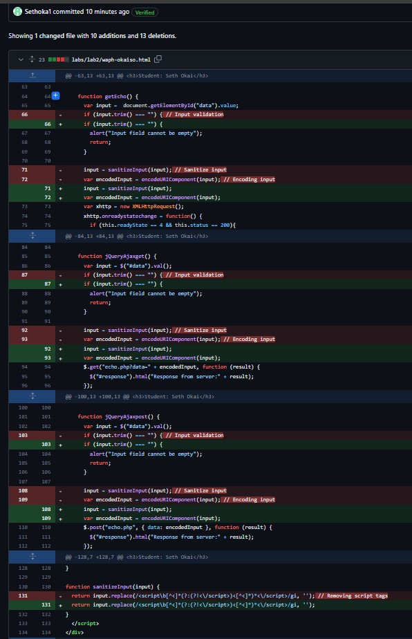

# WAPH-Web Application Programming and Hacking
## Instructor: Dr. Phu Phung

## Student: Seth Okai

# Hackathon 1 - Cross-site Scripting Attacks and Defenses

## The lab's overview

In my XSS exploitation endeavors, I successfully compromised Levels 2, 4, 5, and 6 of the target web application while encountering difficulties with Level 3. My methods involved crafting and executing JavaScript payloads through various injection points, showcasing vulnerabilities in the application's input handling mechanisms.I also revised my vulnerable, insecure code in Lab 1 and Lab 2 by implementing input validation and XSS defense methods 

## Task 1 Attack

### Level 0

For level 0 I just executed a script in the url and it worked because there were not any defenses set up for the site.

### Level 1

For level 1 i just had to change the quotes to single quotes to bypass any defenses

### Level 2

For Level 2, I utilized a POST request to inject an XSS payload into the application. By submitting a crafted payload through the console, I triggered an alert message, demonstrating the ability to execute arbitrary JavaScript code on the target page.

### Level 3

Since the script tags are being filtered I used the src attribute to point to a nonexistent image this causes the onerror event to be triggered executing my Javascript code

### Level 4

In Level 4, I employed an XSS payload embedded within an SVG tag. This payload was able to bypass the application's input filters and execute upon loading the SVG element, leading to the successful display of an alert message.

### Level 5

Level 5 posed a challenge due to script tag filtering. However, I overcame this obstacle by encoding my payload and injecting it as an image source attribute. By crafting the payload in this manner, I bypassed the script tag filter, allowing for the successful execution of JavaScript code upon image loading, resulting in the desired alert message being displayed.

### Level 6

In Level 6, I utilized an obfuscated JavaScript payload to bypass server-side defenses. Despite potential input validation and sanitization measures, the payload successfully executed, triggering the alert message as intended.

## Task 2 Defense

For my echo .php file I added input validation and sanitization to the PHP script. First, I checked if the 'data' field was set in the request using isset(), ensuring it was provided by the user. If not, I generated an error message and terminated the script. For input sanitization, I utilized the htmlentities() function to convert special characters to HTML entities, mitigating potential XSS attacks by rendering harmful code harmless when displayed in the browser. This implementation offers basic protection, but I recognize the importance of customizing validation and sanitization based on specific application requirements for robust security measures

I updated the email.js code with input validation and encoding features. By using a regular expression pattern, input validation reduces the possibility of accepting malicious or incorrect data by guaranteeing that user-provided data—in this case, an email address—follows a predetermined standard. Furthermore, I used the encodeInput() function to implement encoding, which escapes any HTML special characters in the input before displaying it on the webpage. The code improves the application's security by reducing the possibility of both cross-site scripting (XSS) attacks and malicious data.

In my html code , robust defenses against Cross-Site Scripting (XSS) attacks were implemented through input sanitization and encoding. The sanitizeInput function utilizes a regular expression to remove any <script> tags from user input, ensuring that no malicious scripts can be injected into the application. Additionally, the encodeURIComponent function is used to encode the sanitized input before sending it to the server via XMLHttpRequest or jQuery Ajax requests. This encoding mechanism protects against XSS vulnerabilities by converting special characters into their respective encoded representations, thereby preventing script injection attacks. 

