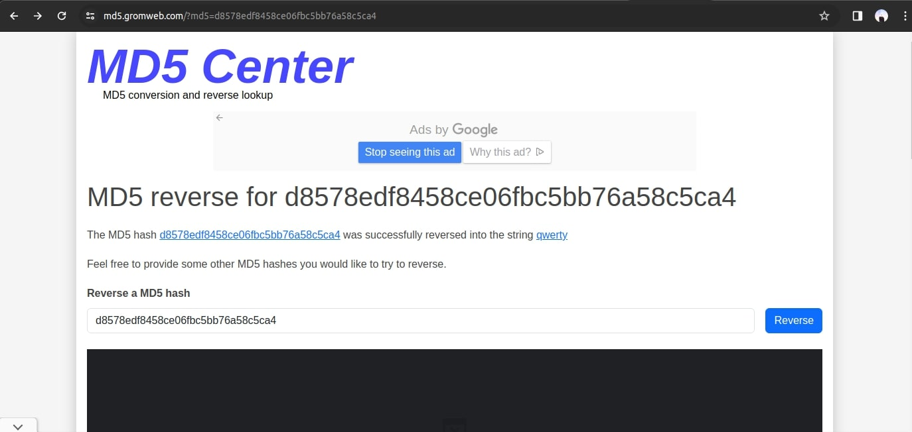

# WAPH-Web Application Programming and Hacking

## Instructor: Dr. Phu Phung

## Student: Seth Okai

# Hackathon 1 - Cross-site Scripting Attacks and Defenses

## Overview and Requirements

In my SQLi exploitation endeavors, I successfully attacked all of the levels of the target web application. My methods involved crafting and executing Sql payloads through various injection points, showcasing vulnerabilities in the application's.
### Level 0

- **Description**: I  Injected SQL code with my University’s username to bypass the login check and successfully log in to the system.

  
### Level 1

  
  
- **Description**:Injected SQL code leveraging the UNION SELECT statement to display specific information on the page. Utilized the LIMIT function in conjunction with the SQL injection payload to ensure only the desired information is retrieved.
  

### Level 2 - Exploiting SQLi to Access Data

### Detecting SQLi Vulnerabilities

- **Description**: used different inputs to see if the application responds in a way that indicates a vulnerability. An example of an error page above tells me I got the number of columns wrong.

#### Sub-task: Identify the Number of Columns

I found out the number of columns was 3 by using Union Select and identifying which query worked for the number of columns I tried to select.

- **Description**: Utilized SQL injection techniques to identify the number of columns in the database table. I experimented with different payloads including UNION SELECT statements to determine the correct number of columns required for injection.

#### Sub-task: Display Your Information

 

#### Sub-task: Display the Database Schema

- **Description**: Exploited SQLi vulnerabilities to retrieve the entire database schema. Used SQL injection techniques to extract information about all tables and their columns in the database.

#### Sub-task: Display Login Credentials

- **Description**: Identified the table and columns storing usernames and passwords in the database. Constructed an SQL injection query incorporating the LIMIT function to display a limited number of rows containing login credentials.

#### Sub-task: Login with Stolen Credentials

- **Description**: Utilized stolen login credentials obtained through SQL injection to log in to the system. Demonstrated the successful exploitation of SQLi vulnerabilities to gain unauthorized access to the application.
  
- Used the hash to find the password
  

