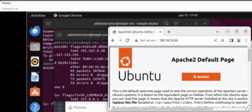
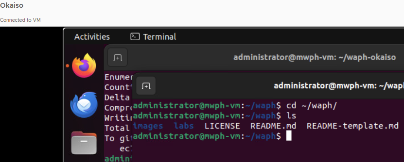

# WAPH-Web Application Programming and Hacking

## Instructor: Dr. Phu Phung

# Lab 0 - Development Environment Setup

## Lab Overview
[lab Folder](https://github.com/Sethoka1/waph-okaiso/tree/9a482a0547bf8c856ce2cb9f2a4811e72159f0f5/labs/lab0)

# Report

## Part 1
Steps to deploy Ubuntu 22.04 Virtual Machine
 - Request Machine to be deployed 
 - Connect via Remote Console
   
Steps to install the required software
 - Install net-tools to be able to view the IP adress sudo apt install net-tools)
   
 - Install Apache2 ($Sudo apt install apache2)
   
 - Install git ($Sudo apt install git)
   
 - Install Sublime-text editor ($sudo apt install sublime-text --classic)
   
 - Install Pandoc,pdflatex and its fonts to render PDF files
   
    -($Sudo apt install pandoc)
    -($Sudo apt-get install texlive-latex-base)
    -($sudo apt-get install texlive-fonts-recommended)
    -($sudo apt-get install texlive-latex-extra)
    -($sudo apt-get install texlive-fonts-extra)
   
 -Install Chrome browser

### Apache Web Server Testing

## Part 2
### The Course repository

### Private repository
To create a Private Repository in GitHub you have to:
 - Create a GitHub Account
 - Click the New button which indicates a new repository
 - Add your Repository name (waph-okaiso)
 - Sharing my repository with the professor
    -Click to settings
   
    -click collaborators
   
    -click add people
   
    -add your collaborator (phungph-waph)
   [My private Repository](https://github.com/Sethoka1/waph-okaiso.git)

### Exercises
In this lab, I generated SSH keys to add to my GitHub account:
  - Generate public key ($ssh-keygen)
    
  - View public key (cat ~/ .ssh/id_rsa.pub)

  - copy key
    
  - go to settings
    
  - go to SSH and GPG Keys
    
  - Add the New SSH Key

In this Lab, I cloned my Remote Repository by using the "$git clone (URL)" command

I also had to configure git information before i could synchronize my code:
 -$git config --global user.name "your-email"
 
 -$git config --global user.name"Your Name"

 I used the Sublime text editor to edit my README file in markdown format.
 For the required template I had to include a headshot image and to do that I created an Image folder and uploaded my screenshot. From there I just used Markdown language to link the image in my code: '
 

   

  

 
