# WAPH-Web Application Programming and Hacking

## Instructor: Dr. Phu Phung

## Student: Seth Okai


# Lab 1 - Foundations of the Web 

## The lab's overview

In this lab, I learned a lot about using CGI and PHP in web application development. I also Learned how to use Wireshark to view different types of requests and responses. Lastly, I was able to use curl to create an HTTP post request with my name in the data.

**Lab Folder**
[https://github.com/Sethoka1/waph-okaiso/tree/881c048f60a3d1084ef65ff9d2fb517daa184da5/labs/lab1]

## Part I: The Web and HTTP Protocol

### Task 1  Familiar with the Wireshark tool and HTTP protocol
I started a traffic capture on WireShark, sent an HTTP request to 'example.com' via my browser, and used Wireshark filters to isolate only HTTP traffic.

**HTTP Request**

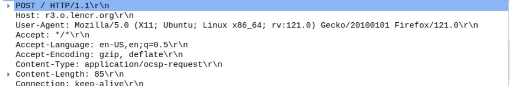


**Http Response**

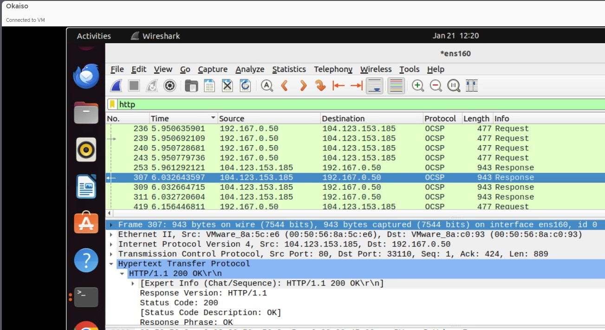

**Http Stream**

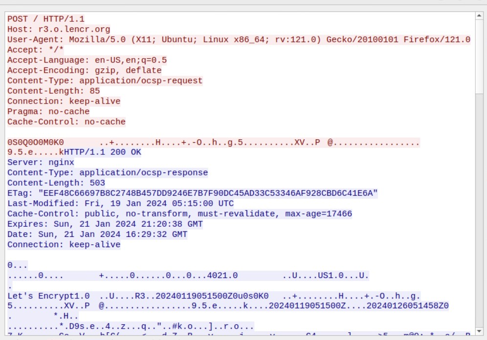

      
### Task 2 (10 pts). Understanding HTTP using telnet and Wireshark.

**HTTP request from terminal**

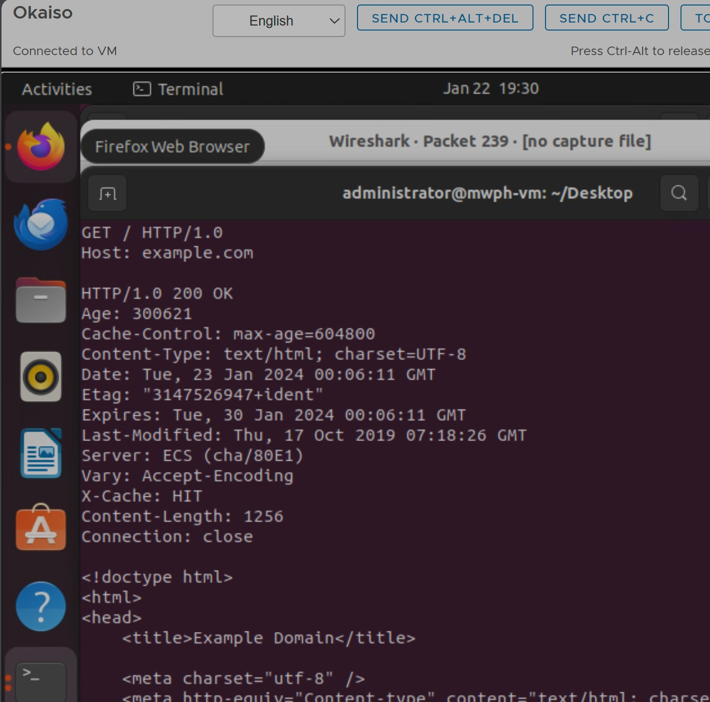


**HTTP request from Wireshark**

- From wire shark the carriage return character and line -feed character is included in the request unlike the terminal request

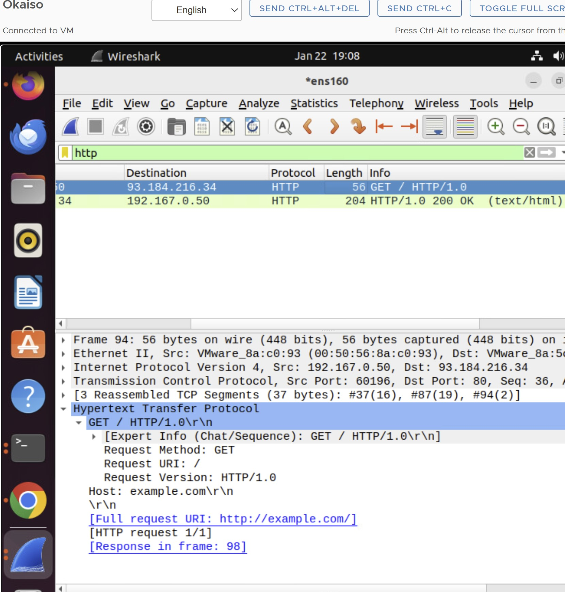

- There isn't any difference between the response message in wire shark and the one from the terminal


### Part II: Basic Web Application Programming

   1.  CGI Web applications in C
       - Make a c file named hello.world.c
         
       - Write the c code
         
       - Install GCC compiler
     
       - Use GCC to compile the code
         
       - Test the code using ./helloworld.cgi"
         
       - Move the code to /usr/lib/cgi-bin/
         
       - Vist the sit using: "ip-address/cgi-bin/helloworld.cgi


        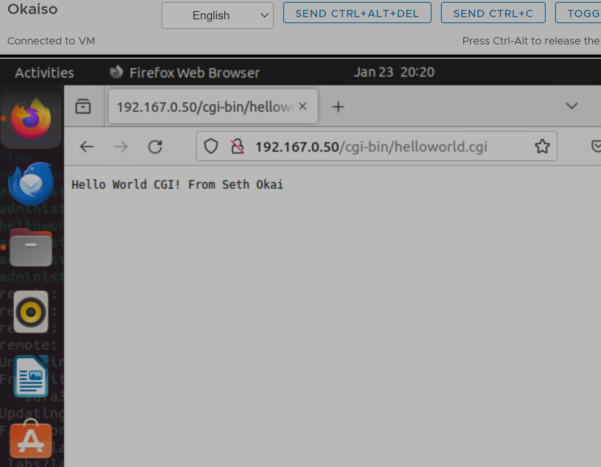


       
       Below is another c cgi program deployed with html


       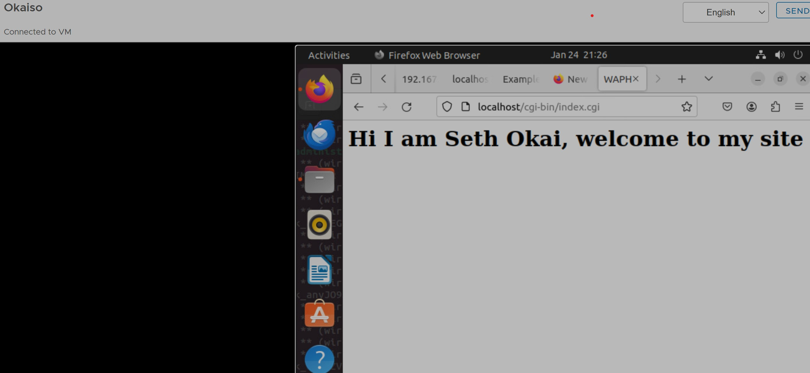


         Included file `index.c`:
       
  ```C
    #include <stdio.h>

    int main() {

          printf("Content-Type: text/html; charset=utf-8\n\n");

    
          printf("<html>\n");
          printf("<head>\n");
          printf("<title>WAPH</title>\n");
          printf("</head>\n");
          printf("<body>\n");
          printf("<h1>Hi I am Seth Okai, welcome to my site</h1>\n");
          printf("</body>\n");
          printf("</html>\n");

          return 0;
}
  ```

       
   3.  A simple PHP Web Application with user input
       - Install php and configure it to work with Apache webserver ($Sudo agt-get install php libapache2-mod-php -y)
       
       - Make a PHP file named hello.world.PHP
         
       - Write the php code
         
       - Install GCC compiler
         
       - Deploy the code to webserver root directory (/var/www/html/)
         
       - Vist the sit using: "ip-address/helloworld.php
         
         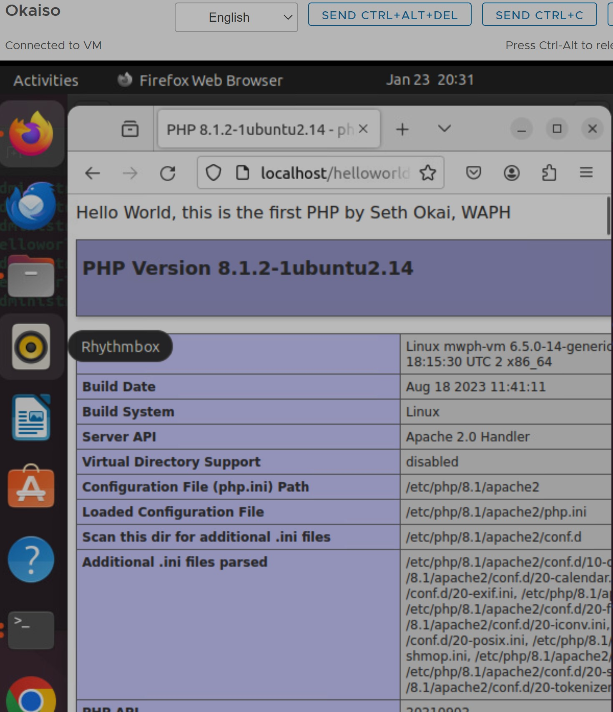

       Below is another php program with  my name in the data:
       
       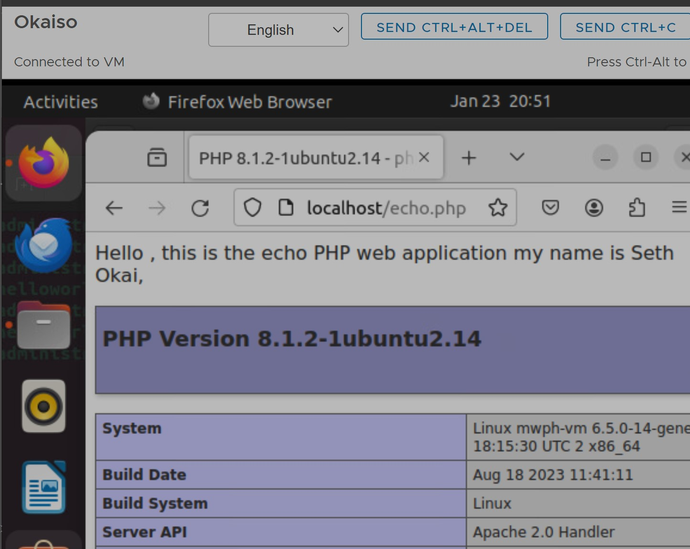

       

        Included file `echo.php`:
       
 ```C
    <?php
        echo $_REQUEST['data'];
?>

   ```
   

This web application is vulnerable to cross-site scripting (XSS) because there isn't any sanitization of inputs.


## Task 3

  Understanding HTTP GET and POST requests

  I started a capture on wireshark to examine the echo.php page with my name in it.

  Below are the response and request pages

  **Echo Response**

 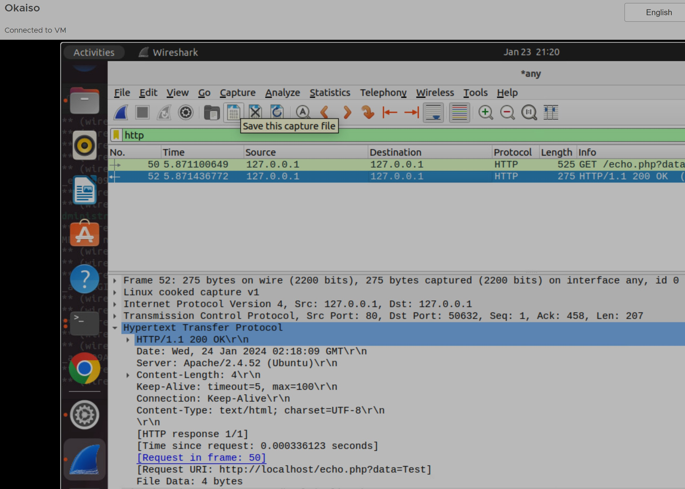

   **Echo Request**

  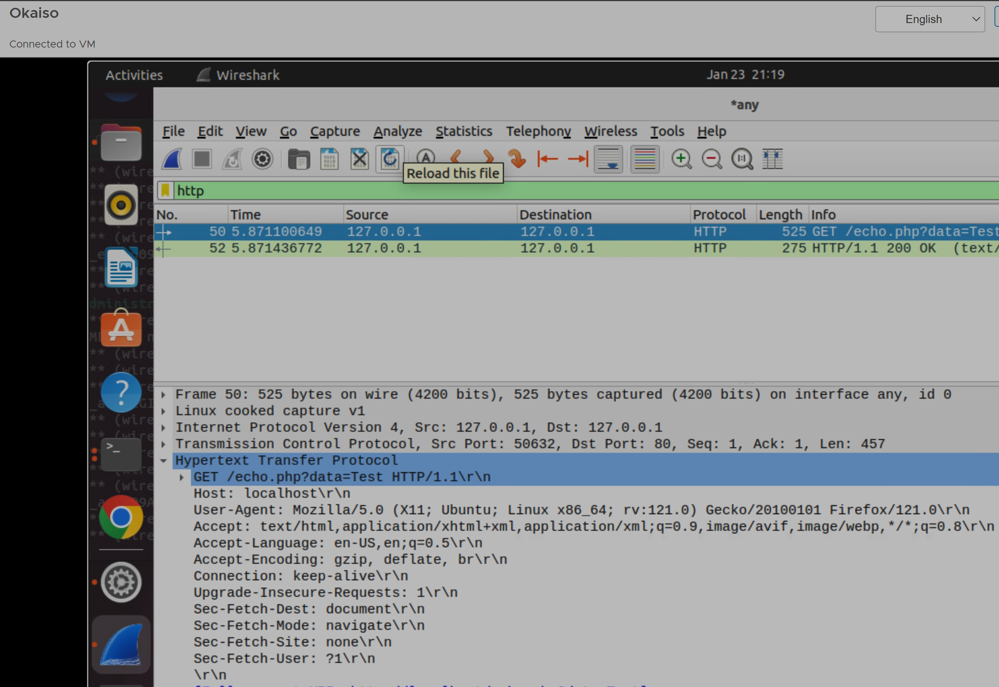

Using curl I was able to post a request ($curl -X POST [URL] -d [fieldname=input]
      
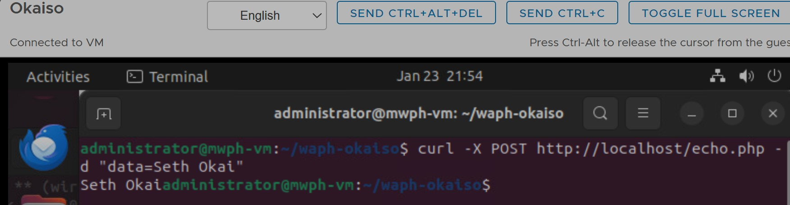

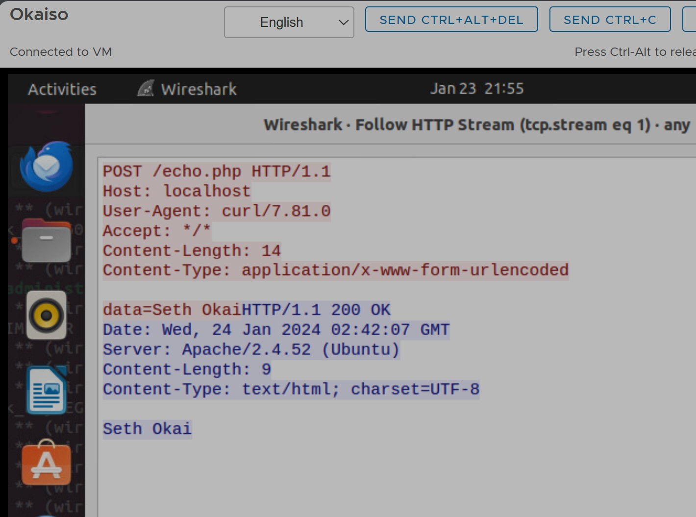

Both the GET and POST requests are HTTP protocols, but the parameters are visible in the URL for the GET request and data is transmitted in the body of the HTTP packet for the post request.


