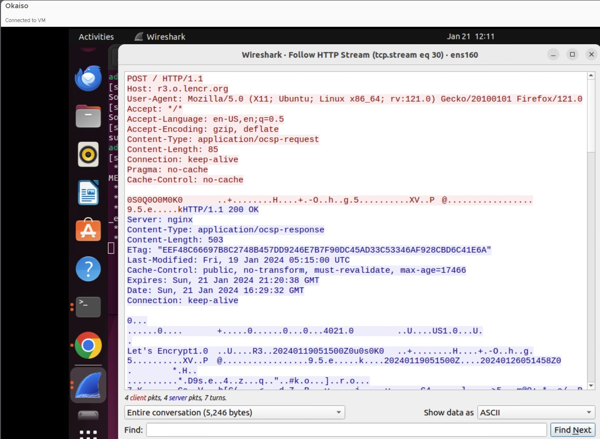
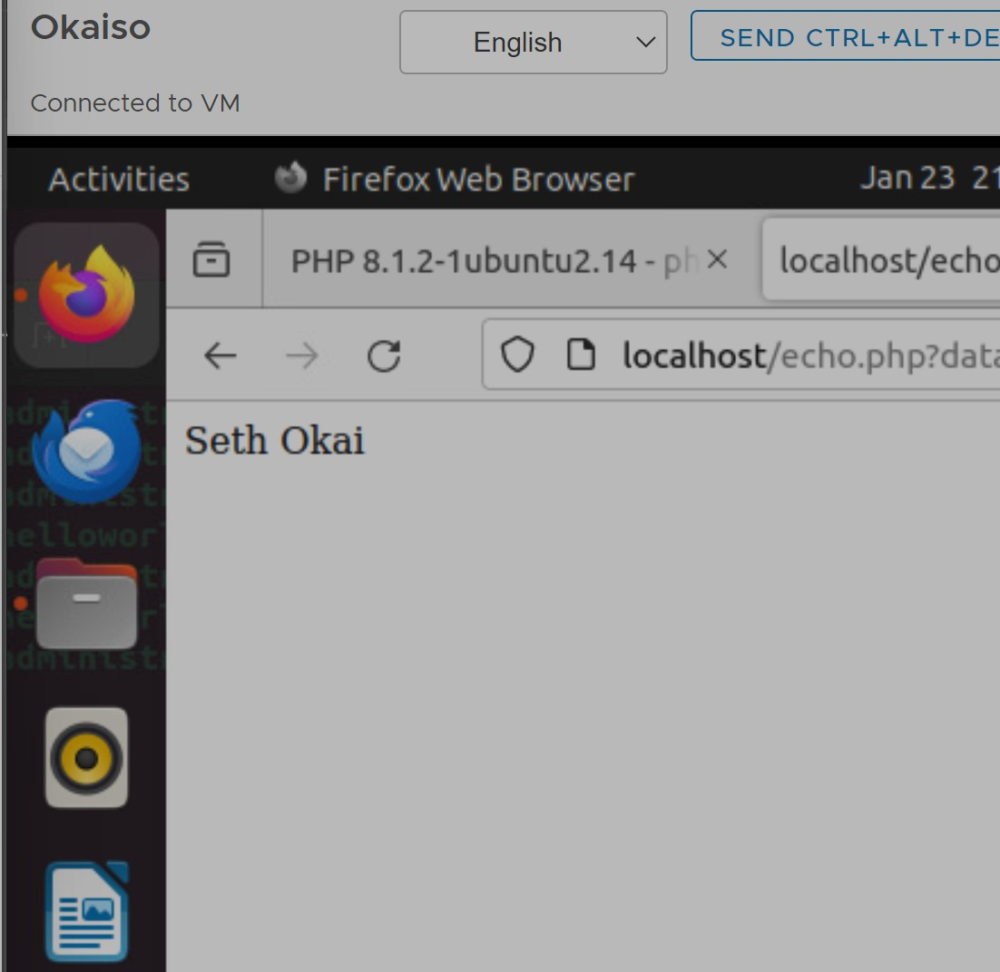

# WAPH-Web Application Programming and Hacking

## Instructor: Dr. Phu Phung

## Student: Seth Okai


# Lab 1 - Foundations of the Web 

## Overview 

This lab is covered in Lecture 3 with the following tasks.

## Part I: The Web and HTTP Protocol

### Task 1  Familiar with the Wireshark tool and HTTP protocol
I started a traffic capture on WireShark, sent an HTTP request to 'example.com' via my browser, and used Wireshark filters to isolate only HTTP traffic.

**HTTP Request**


**Http Response**


**Http Stream**



      
### Task 2 (10 pts). Understanding HTTP using telnet and Wireshark.

**HTTP request from terminal**


**HTTP request from Wireshark**

- From wire shark the carriage return character and line -feed character is included in the request unlike the terminal request


- There isn't any difference between the response message in wire shark and the one from the terminal


### Part II: Basic Web Application Programming

   1.  CGI Web applications in C
       - Make a c file named hello.world.c
         
       - Write the c code
         
       - Install GCC compiler
     
       - Use GCC to compile the code
         
       - Test the code using ./helloworld.cgi"
         
       - Move the code to /usr/lib/cgi-bin/
         
       - Vist the sit using: "ip-address/cgi-bin/helloworld.cgi
     
        

       
       Below is another c cgi program deployed with html

         Included file `index.c`:
   ```C
     #include <stdio.h>
int main(void) {
   printf("Content-Type: text/plain; charset=utf-8\n\n");
   printf("<!DOCTYPE html> <html> <head> <title> Seth Okai </title> </head> <body> <h1> WAPH </h1> <p>Welcome</p></body></html>\n\n");
  return 0;
}
      }
   ```

       
   3.  A simple PHP Web Application with user input
       - Install php and configure it to work with Apache webserver ($Sudo agt-get install php libapache2-mod-php -y)
       
       - Make a PHP file named hello.world.PHP
         
       - Write the php code
         
       - Install GCC compiler
         
       - Deploy the code to webserver root directory (/var/www/html/)
         
       - Vist the sit using: "ip-address/helloworld.php
         
         

       Below is another php program with a my name in the data:
       
       

       

           Included file `echo.php`:
   ```C
     <?php
        echo "Hello , this is the echo PHP web application my name is Seth Okai,";
        phpinfo();
?>

   ```

This web application is doesn't have any security risks since its just printing out a simple greeting but if I was to accept User inputs I would be vulnerable to cross-site scripting (XSS) because there isn't any sanitization of inputs.
      
   5. Task 3 (10 pts). Understanding HTTP GET and POST requests


## The lab's overview


