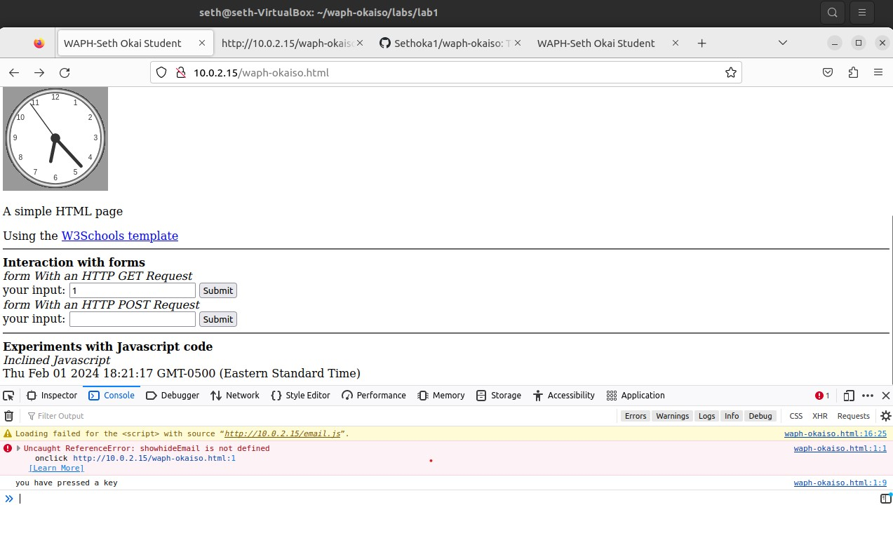

# WAPH-Web Application Programming and Hacking

## Instructor: Dr. Phu Phung

## Student: Seth Okai


# Lab 1 - Front-end Web Development 

## The lab's overview

This lab showcases a meticulous application of HTML and JavaScript concepts, emphasizing not only the creation of a visually appealing web page but also the implementation of interactive features. By using both inline and external JavaScript, the lab demonstrates an understanding of code organization and modularity, essential principles for scalable and maintainable web development projects.

### Part I - Task 1:

#### HTML Structure and Elements:
- Developed a structured HTML document incorporating essential tags such as `<html>`, `<head>`, `<body>`, `<h1>`, `<p>`, and ``.
- Employed semantic HTML to enhance document structure and accessibility.
- Integrated a form (`<form>`) within the HTML document to facilitate user input, demonstrating knowledge of form elements and attributes.
- The form worked with the echo.php web application to post and get HTML requests
  
- #### Digital Clock:
- Created a dynamic digital clock using JavaScript embedded within a `<script>` tag.
- Utilized the `setInterval` function to update the clock at regular intervals, providing real-time information to users.

   

#### JavaScript Interactivity:
- Implemented inline JavaScript within HTML tags to enhance interactivity:
  - Click events were utilized to display the current date/time in a designated area.
  - Key press events were logged to the browser console for debugging and interactivity feedback.
  -  


#### External JavaScript for Enhanced Functionality:
- Developed an external JavaScript file (`email.js`) for showing/hiding an email address on a button click.
  - Promoted code modularity and maintainability by separating functionality into distinct files.

```js
var shown = false;

function showhideEmail() {
  if (shown) {
    document.getElementById('email').innerHTML = "Show my email";
    shown = false;
  } else {
    var myemail =
      "<a href='mailto:okaiso" +
      "@" +
      "ucmail.uc.edu'>okaiso" +
      "@" +
      "ucmail.uc.edu</a>";
    document.getElementById('email').innerHTML = myemail;
    shown = true;
  }
}


  ```

    
- Integrated another external JavaScript file (`clock.js`) to display an analog clock using the `<canvas>` element.
  - Utilized external resources to enhance functionality and keep code organized.
    [ https://waph-uc.github.io/clock.js]( https://waph-uc.github.io/clock.js)

### Task 2
#### Ajax
The Ajax request operates as follows: upon user interaction with the web page, triggered by entering data into the input field and clicking the associated "Submit" button, the JavaScript function getEcho() is invoked. This function utilizes the XMLHttpRequest object to construct a GET request to the echo.php script with the user's input as a query parameter. The browser's developer tools, specifically the "Network" tab, allow for real-time inspection of this interaction. Upon triggering the Ajax request, a new entry appears in the network log, detailing the request method, headers, and the server's response. This technology enables asynchronous communication between a web page and a server. 
[Ajax](Images/ajax.jpg)


#### GitHub Repository Link:
**Lab Folder**
[https://github.com/Sethoka1/waph-okaiso/tree/881c048f60a3d1084ef65ff9d2fb517daa184da5/labs/lab1](https://github.com/Sethoka1/waph-okaiso/tree/881c048f60a3d1084ef65ff9d2fb517daa184da5/labs/lab1)


