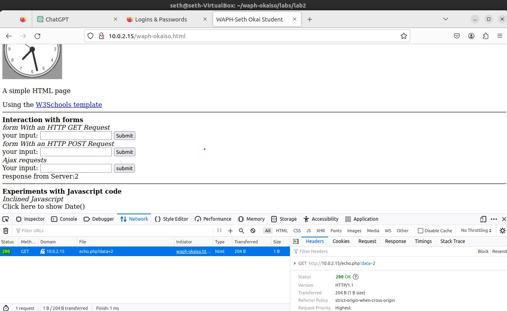

# WAPH-Web Application Programming and Hacking

## Instructor: Dr. Phu Phung

## Student: Seth Okai


# Lab 2 - Front-end Web Development 

## The lab's overview

In Lab 2, I  integrated HTML, CSS, JavaScript, jQuery, and Ajax to develop a dynamic and interactive web page. This lab not only builds upon the foundational concepts from Lab 1 but also introduces the integration of API concepts, adding a new layer of functionality to the web page.

### Part I - Task 1:

#### HTML Structure and Elements:
- Developed a structured HTML document incorporating essential tags such as `<html>`, `<head>`, `<body>`, `<h1>`, `<p>`, and ``.
- Employed semantic HTML to enhance document structure and accessibility.
- Integrated a form (`<form>`) within the HTML document to facilitate user input, demonstrating knowledge of form elements and attributes.
- The form worked with the echo.php web application to post and get HTML requests
  
- #### Digital Clock:
- Created a dynamic digital clock using JavaScript embedded within a `<script>` tag.
- Utilized the `setInterval` function to update the clock at regular intervals, providing real-time information to users.

   

#### JavaScript Interactivity:
- Implemented inline JavaScript within HTML tags to enhance interactivity:
  - Click events were utilized to display the current date/time in a designated area.
  - Key press events were logged to the browser console for debugging and interactivity feedback.
    
    


#### External JavaScript for Enhanced Functionality:
- Developed an external JavaScript file (`email.js`) for showing/hiding an email address on a button click.
  - Promoted code modularity and maintainability by separating functionality into distinct files.

```js
var shown = false;

function showhideEmail() {
  if (shown) {
    document.getElementById('email').innerHTML = "Show my email";
    shown = false;
  } else {
    var myemail =
      "<a href='mailto:okaiso" +
      "@" +
      "ucmail.uc.edu'>okaiso" +
      "@" +
      "ucmail.uc.edu</a>";
    document.getElementById('email').innerHTML = myemail;
    shown = true;
  }
}


  ```

    
- Integrated another external JavaScript file (`clock.js`) to display an analog clock using the `<canvas>` element.
  - Utilized external resources to enhance functionality and keep code organized.
    [ https://waph-uc.github.io/clock.js]( https://waph-uc.github.io/clock.js)

### Task 2
### Ajax
The Ajax request operates as follows: upon user interaction with the web page, triggered by entering data into the input field and clicking the associated "Submit" button, the JavaScript function getEcho() is invoked. This function utilizes the XMLHttpRequest object to construct a GET request to the echo.php script with the user's input as a query parameter. The browser's developer tools, specifically the "Network" tab, allow for real-time inspection of this interaction. Upon triggering the Ajax request, a new entry appears in the network log, detailing the request method, headers, and the server's response. This technology enables asynchronous communication between a web page and a server. 



### CSS
I added CSS using inline, external, and internal methods.


***Internal CSS***
```Internal CSS
<style>
  .button {
    background-color: #4CAF50;
    border: none;
    color: white;
    padding: 5px;
    text-align: center;
    text-decoration: none;
    display: inline-block;
    font-size: 12px;
    margin: 4px 2px;
    cursor: pointer;
  }

  .round {
    border-radius: 8px;
  }

  #response {
    background-color: #ff9800;
  }
</style
```
***Inline CSS***
```Inline CSS
 <input class="button round" type="button" value="jQuery Ajax GET ECHO" onclick="jQueryAjaxget()">
```
***External CSS***
```External CSS
<link rel="stylesheet" href="https://waph-uc.github.io/style1.css">
```

### Jquery
I implemented HTML and JavaScript code in jQuery so that I can send an Ajax GET request to the echo.php web application and display the response content When the corresponding button is clicked.

 

I also implemented HTML and JavaScript code in jQuery so that I can send an Ajax post request to the echo.php web application and display the response content When the corresponding button is clicked.

 

### WEB API Implementation
I used jQuery Ajax to send a request and handle the response to display a random joke from an API when the page is loaded


I added HTML and JavaScript code to use the fetch() method to call an API with user input and display the response results. 


 


#### GitHub Repository Link:
**Lab Folder**
[https://github.com/Sethoka1/waph-okaiso/tree/881c048f60a3d1084ef65ff9d2fb517daa184da5/labs/lab1](https://github.com/Sethoka1/waph-okaiso/tree/881c048f60a3d1084ef65ff9d2fb517daa184da5/labs/lab1)


