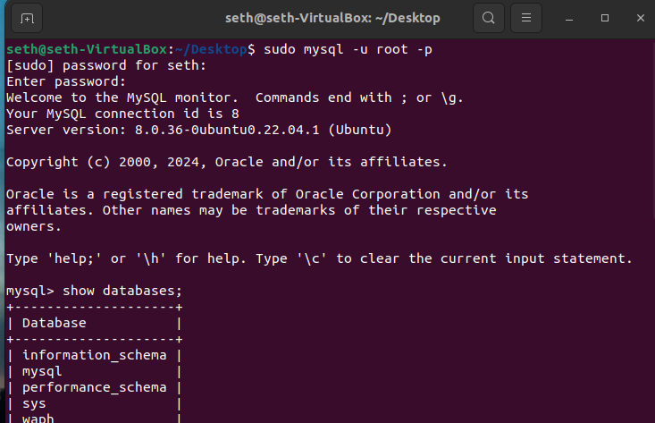
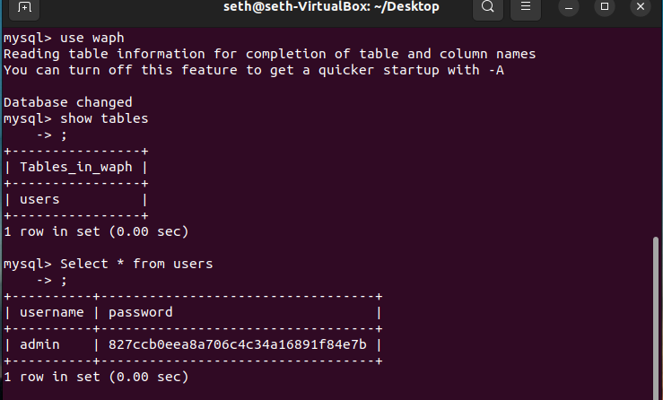
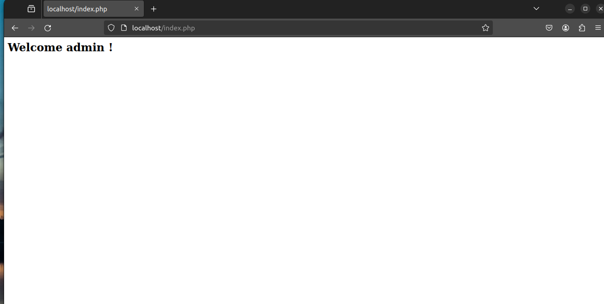
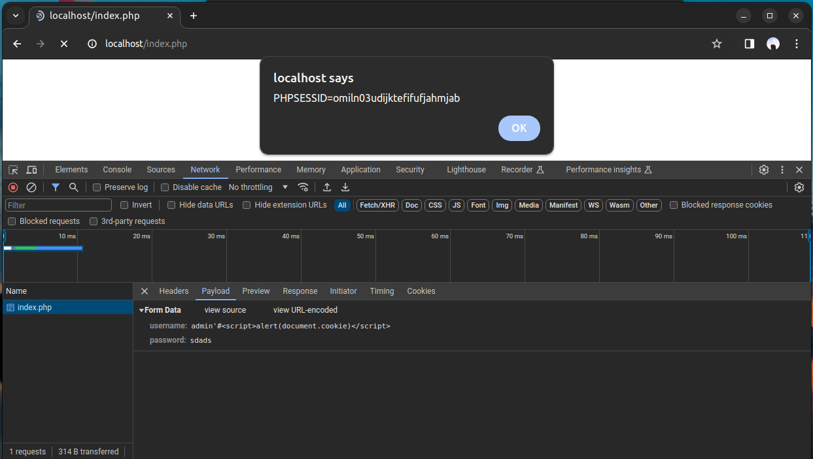

# WAPH-Web Application Programming and Hacking

## Instructor: Dr. Phu Phung

## Student: Seth Okai


# Lab 2 - Front-end Web Development 

## The lab's overview

In Lab 3, I Installed Mysql, created a new database with tables and permissions, interacted with a login system with PHP/MySQL, and Performed XSS and SQL Injection attacks. After performing the attacks I implemented a prepared statement for SQL injection prevention.

## Database Setup and Management
 - I used sudo "apt-get install mysql-server -y" to install MySQL server
   
 - I then used "sudo mysql -u root -p to connect to the MySQL server, pressing enter when prompted for a password

## Database Creation, Database User and Permission 

 - I created a new database Waph and granted my user Seth all permissions using a database-account.sql file
   
 ```
   create database waph;
  " Create User 'setg'@localhost' IDENTIFIED BY 'ubuntu';
   GRANT ALL ON waph.* TO 'Admin'@localhost';
```



- Following that I created a new table and inserted data into it
```
drop table if exists users;
create table users(
  username varchar(0) PRIMARY KEY,
  passsword varchar(100) NOT NULL);
INSERT INTO users(username,password) VALUES ('admin, md5('MyPa$$w0rd));

```



## A Simple (Insecure)Login System with PHP/MySQL

- I installed PHP PHP MySQLi extension with sudo apt-get install php-mysqli, and restarted Apache using sudo service apache2 restart.
  
-  I modified index.php by adding a checklogin_mysql function in index.php for database programming authentication
- 
 ```
	function checklogin_mysql($username, $password) {
		$mysqli = new mysqli('localhost', 'okaiso', '12345', 'waph');
		if ($mysqli->connect_errno) {
			printf("Database connection failed: %s\n", $mysqli->connect_error);
			exit(); 
		}

		
		return false;
	}
```

- I was able to log in successfully with the username and password from my database and 
insecurely with the following code options in index.php:

String Concat in PHP 

```
$sql = "SELECT * FROM users where username='" . $username . "' "; 
$sql = $sql . " AND password = md5('" . $password . "')";
```

```
Variable Injection into String 
$username = $POST["username"]; 
$password = $POST["password"]; 
$sql = "SELECT * FROM users WHERE username='$username' AND password= md5('$password)
```


-  I then Deployed form.php and the modified index.php and tested the login functionality.
  

## Performing XSS and SQL Injection Attacks

### SQL Injection

- Because the form lacks proper input validation, I was able to carry out a successful SQL injection attack using the username 'OR 1=1;#. This exploit worked because the SQL query string concatenation, along with the injected conditional statement 1=1, resulted in a true evaluation, enabling access to all records in the targeted table.
 

### XSS Attack
- The site is vulnerable to XSS due to the lack of Input Validation and Output Encoding
I was able to attack this site with the code : admin '#<script>alert(document.cookie)</script>



### Prepared Statement Implementation


  

  
